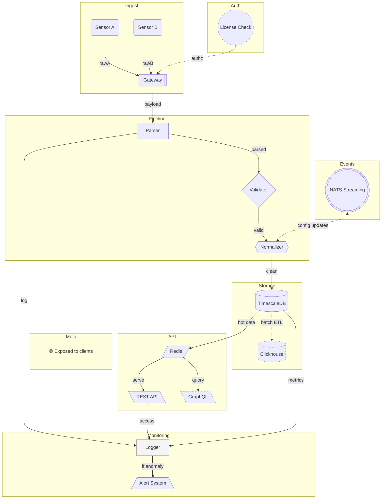

<!-- BEGIN_MERMAID -->

```mermaid
flowchart TD

	subgraph API

	cache[/"Redis"/]

	rest[\"REST API"\]

	graphql[\"GraphQL"\]
	style graphql stroke-dasharray: 5 5
	end

	subgraph Auth

	licence(("License Check"))
	style licence stroke-dasharray: 5 5
	end

	subgraph Events

	nats((("NATS Streaming")))
	end

	subgraph Ingest

	sensor_A("Sensor A")

	sensor_B("Sensor B")

	gateway[["Gateway"]]
	end

	subgraph Meta

	comment_api["🌐 Exposed to clients"]
	style comment_api fill: transparent,stroke: transparent
	end

	subgraph Monitoring

	logger["Logger"]
	style logger fill:#f5f5f5,stroke:#aaa

	alert[/"Alert System"\]
	end

	subgraph Pipeline

	parser["Parser"]

	validator{"Validator"}

	normalizer{{"Normalizer"}}
	end

	subgraph Storage

	db[("TimescaleDB")]

	analytics[("Clickhouse")]
	style analytics stroke-dasharray: 5 5
	end

	sensor_A -->|"rawA"| gateway
	sensor_B -->|"rawB"| gateway
	gateway -->|"payload"| parser
	parser -->|"parsed"| validator
	validator -->|"valid"| normalizer
	normalizer -->|"clean"| db
	db -.->|"batch ETL"| analytics
	db -->|"hot data"| cache
	cache -->|"serve"| rest
	cache -->|"query"| graphql
	licence -.->|"authz"| gateway
	nats <-.->|"config updates"| normalizer
	parser -->|"log"| logger
	rest -->|"access"| logger
	db -->|"metrics"| logger
	logger ==>|"if anomaly"| alert
	comment_api ~~~ rest
```
<!-- END_MERMAID -->