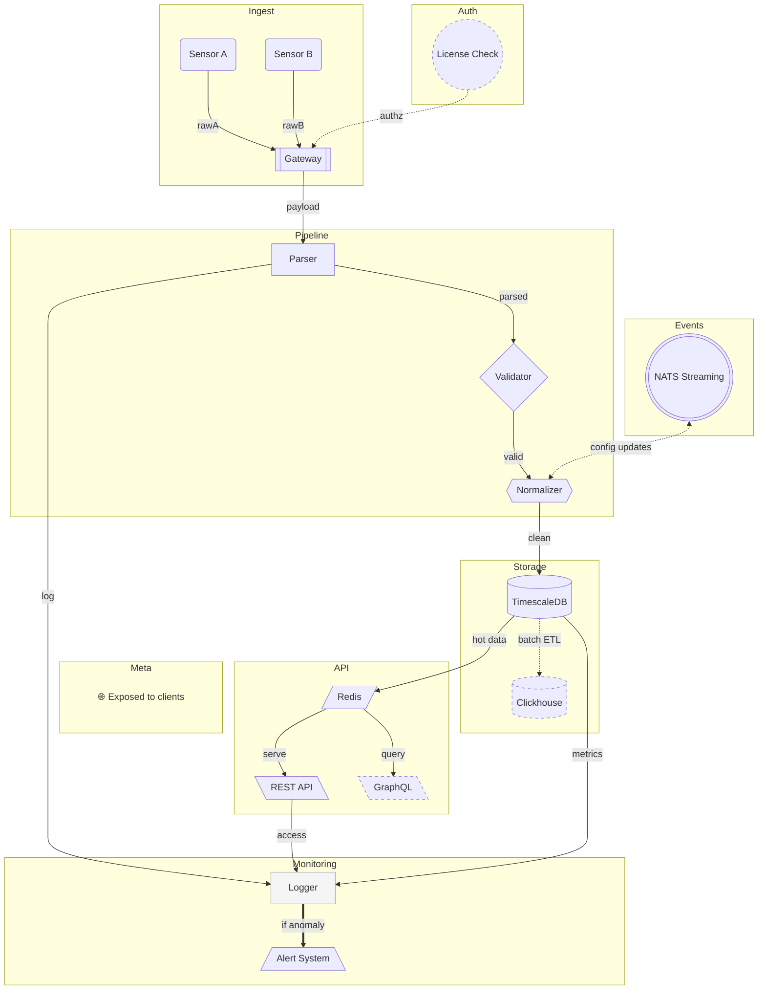

# mermaid

**mermaid** — это библиотека на Go для генерации диаграмм в формате [Mermaid.js](https://mermaid.js.org/).

**mermaid** is a Go library for generating diagrams in [Mermaid.js](https://mermaid.js.org/) format.

---

## 🧩 Назначение | Purpose

Эта библиотека позволяет описывать flowchart и sequence-диаграммы программно, а затем:

- получить текст диаграммы в формате Mermaid;
- либо автоматически вставить/обновить блок диаграммы в `README.md` между маркерами.

This library allows you to describe flowchart and sequence diagrams in code and either:

- retrieve the resulting Mermaid syntax as a string;
- or automatically update a block in `README.md` between defined markers.

---

## ⚙️ Использование | Usage

Библиотека используется как часть Go-приложений.  
Инструмент `RenderUpdateREADME(path)` может:

- вставить или обновить Mermaid-диаграмму в `README.md`;
- или вернуть Mermaid-код через метод `Render()` без изменения файлов.

> ⚠️ Если в целевом файле отсутствуют маркеры `<!-- BEGIN_MERMAID -->` и `<!-- END_MERMAID -->`, обновление не выполняется — будет возвращена ошибка.

The library is intended for use within Go programs.  
The `RenderUpdateREADME(path)` method can:

- update or insert a Mermaid diagram inside a README;
- or return the diagram as a string via `Render()` without modifying any files.

> ⚠️ If the target file does not contain the `<!-- BEGIN_MERMAID -->` and `<!-- END_MERMAID -->` markers, the update is not performed and an error is returned.

---
## ✅ Совместимость и стиль | Linting

Код проверен с помощью `golangci-lint`. Используются правила:

- `gosec`
- `revive`
- `gocritic`
- и другие

Code quality is maintained via `golangci-lint`, with security and style linters enabled.

---

<!-- BEGIN_MERMAID -->

<!-- END_MERMAID -->