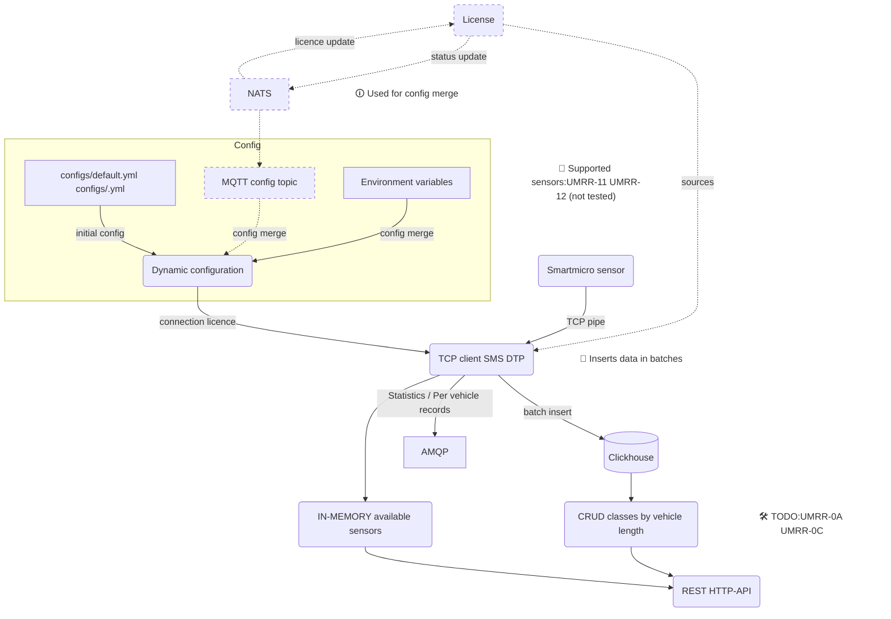

testsdafsa
asdfasd
fsdfa
sdf
asf
asdf
ads
f
asdfs
adf
sdf
asdf
sad
fas
df
sdf
<!-- BEGIN_MERMAID -->

```mermaid
flowchart TD


	SMS("Smartmicro sensor")

	tcp("TCP client SMS DTP")

	DB[("Clickhouse")]

	crud("CRUD classes by vehicle length")

	memory("IN-MEMORY available sensors")

	rest("REST HTTP-API")

	amqp["AMQP"]

	licence("License")
	style licence stroke-dasharray: 5 5

	NATS["NATS"]
	style NATS stroke-dasharray: 5 5

	comment_supported["📌 Supported sensors:UMRR-11 UMRR-12 (not tested)"]
	style comment_supported fill:transparent,stroke:transparent

	comment_todo["🛠️ TODO:UMRR-0A UMRR-0C"]
	style comment_todo fill:transparent,stroke:transparent

	comment_insert["💬 Inserts data in batches"]
	style comment_insert fill:transparent,stroke:transparent

	comment_merge["🛈 Used for config merge"]
	style comment_merge fill:transparent,stroke:transparent
	subgraph Config

	conf("Dynamic configuration")

	confini["configs/default.yml configs/<env>.yml"]

	confmerge["Environment variables"]

	confmergeNATS["MQTT config topic"]
	style confmergeNATS stroke-dasharray: 5 5
	end

	SMS -->|"TCP pipe"| tcp
	tcp -->|"batch insert"| DB
	tcp -->|"Statistics / Per vehicle records"| amqp
	tcp --> memory
	DB --> crud
	crud & memory --> rest
	confini -->|"initial config"| conf
	confmerge -->|"config merge"| conf
	licence -.->|"sources"| tcp
	conf -->|"connection licence"| tcp
	NATS-.->|"licence update"|licence-.->|"status update"|NATS-.->confmergeNATS-.->|"config merge"|conf
	comment_supported ~~~ SMS
	comment_todo ~~~ rest
	comment_insert ~~~ DB
	comment_merge ~~~ confmerge
```
<!-- END_MERMAID -->