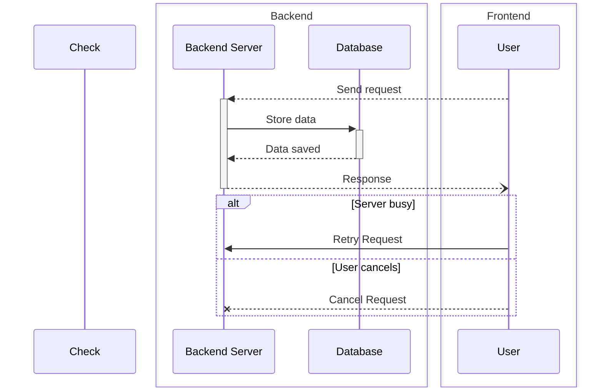

<!-- BEGIN_MERMAID -->

```mermaid
sequenceDiagram

	participant Check
box Backend
	participant Server as Backend Server
	participant DB as Database
end

box Frontend
	participant User
end

	User -->>+ Server : Send request
	Server ->>+ DB : Store data
	DB -->>- Server : Data saved
	Server --)- User : Response
	alt Server busy
	User ->> Server : Retry Request
	else User cancels
	User --x Server : Cancel Request
	end
```
<!-- END_MERMAID -->